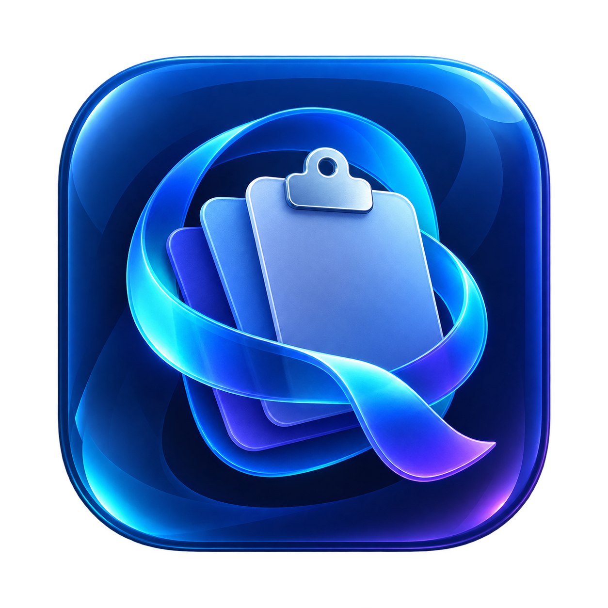

<div align="center">
  
  <h1>Qipli</h1>
  <p><strong>A native clipboard history and sequential paste utility for macOS.</strong></p>
  <p>
    <a href="https://github.com/tomfordrumm/Qipli/releases/latest/download/Qipli.dmg">Download</a> ·
    <a href="https://qipli.yhub.net">Website</a> ·
    <a href="https://github.com/tomfordrumm/Qipli/releases">Releases</a> ·
    <a href="SECURITY.md">Security</a>
  </p>
  <p>
    <a href="https://github.com/tomfordrumm/Qipli/actions/workflows/ci.yml"></a>
    <a href="LICENSE"></a>
    
  </p>
</div>

Qipli keeps 30 days of clipboard history on the current Mac. It supports text,
URLs, inline images, and references to local files or videos. Its Paste Stack
collects text and images and pastes them one by one with the normal `Command-V`
shortcut.

## Why Qipli

- **Local by default.** No account, telemetry, cloud sync, or automatic crash
  reporting.
- **Keyboard-first.** Open History, collect a Paste Stack, and paste through the
  active app without leaving the keyboard.
- **Predictable.** The normal `Command-V` and `Escape` behavior stays unchanged
  outside an active Paste Stack or Finder Cut session.
- **Native.** Qipli uses macOS panels, permissions, settings, and release
  conventions instead of adding a second UI layer.

## Features

### History

Open a searchable shelf of recent copies, select an exact entry, and paste it back
into the app you were using. Individual entries and the complete Qipli history can
be deleted. The menu bar also offers the five most recent History items for
immediate paste.
Favorites remain available beyond automatic History expiry.

### Paste Stack

Collect plain text, formatted text, and images from the active app, review their
order, and paste them one at a time. The compact panel shows previews and expands
for review and reordering. A stack is a temporary session; its active payloads
are protected from automatic History expiry until the session ends.

### Finder Cut

In Finder, use `Command-X` on selected files and `Command-V` in a destination
folder to request Finder's native move. A compact panel shows the prepared
selection. Finder handles file operations, conflicts, and permissions.

### Configurable shortcuts

History, Paste Stack, and Reactivate Previous shortcuts can be changed in
Settings and restored to their defaults. The regular `Command-V` and `Escape`
commands are not configurable.

### Updates you control

Use `Check for Updates…` from the menu bar or Settings for a manual check.
Periodic checks are off by default and start only after you enable them.

## Requirements

- macOS 14 or newer
- Accessibility permission for global shortcuts and synthetic paste commands

## Install

1. Download [`Qipli.dmg`](https://github.com/tomfordrumm/Qipli/releases/latest/download/Qipli.dmg).
2. Open the disk image and drag `Qipli.app` to Applications.
3. Eject the disk image, launch Qipli, and follow the optional onboarding.
4. If macOS asks for it, allow Qipli under System Settings > Privacy & Security
   > Accessibility.

The versioned DMG and its `.sha256` file remain available on the release page for
manual verification. Public DMGs and app bundles are signed with Developer ID,
notarized by Apple, and checked with Gatekeeper before publication. The ZIP is the
immutable Sparkle update artifact. Do not install builds from an untrusted fork or
an unsigned CI run.

## Shortcuts

| Action | Default shortcut |
| --- | --- |
| Open History | `Command-Shift-V` |
| Start or collect a Paste Stack item | `Command-Shift-C` |
| Paste the next Stack item | `Command-V` while a Stack is active |
| Reactivate the last dispatched Stack item | `Command-Shift-Z` |
| Cancel the active Stack | `Escape` |

The three Qipli shortcuts can be changed in Settings and restored to their
defaults. The regular `Command-V` and `Escape` commands are not configurable.

## Privacy

Qipli stores copied text, URLs, filenames, file references, and managed image data
locally on the current Mac for 30 days. It has no account, telemetry, cloud sync,
or automatic crash reporting. Qipli does not automatically recognize passwords,
API keys, or other sensitive content, so copied secrets can enter local history.
You can delete one history item or clear all Qipli history at any time.

The only runtime network path is Sparkle: a manual check, or periodic checks after
explicit opt-in, reads Qipli's public GitHub Pages appcast and a selected GitHub
Release archive. Clipboard text, URLs, filenames, paths, images, History, searches,
previews, and local identifiers are not added to update requests.

## Build and test

Open `Qipli.xcodeproj` in Xcode, or run:

```sh
swift test
xcodebuild \
  -project Qipli.xcodeproj \
  -scheme Qipli \
  -configuration Debug \
  -destination 'generic/platform=macOS' \
  build \
  CODE_SIGNING_ALLOWED=NO \
  CODE_SIGNING_REQUIRED=NO
```

For interactive testing, run the `Qipli` scheme in Xcode with normal Apple
Development signing. Debug builds are named `Qipli Dev.app` and use
`com.qipli.app.dev`. Add this app once under System Settings → Privacy & Security
→ Accessibility; keep the installed Qipli permission enabled. The unsigned
command above is only a build check, not a permission-testing build.

Qipli Dev has separate preferences and no Sparkle updates, but intentionally
shares the installed app's History database and managed assets. Quit one version
before running the other. Deleting History or testing a database migration in Dev
affects the same data used by the installed app.

Release signing credentials never belong in the repository. Pull requests and
pushes to `main` run unsigned tests and builds only.

## Project docs

- [Product contract](docs/PRODUCT.md)
- [Technical contract and architecture](docs/TECHNICAL.md)
- [Security policy](SECURITY.md)

## Security

Please report vulnerabilities through the private process described in
[`SECURITY.md`](SECURITY.md). Do not include real clipboard contents, signing
keys, or other secrets in a public issue.

## License

Qipli is available under the [MIT License](LICENSE).
